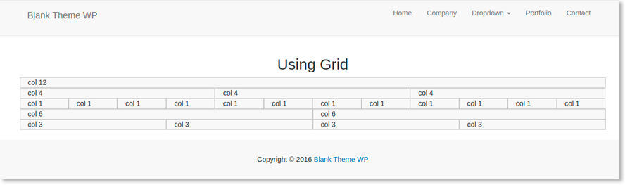

# Blank Theme WP

> Tema em branco para acelerar o desenvolvimento de sites com WordPress

    

## Características
- Assets personalizado com [Gulp Bootstrap](https://github.com/theandersonn/gulp-bootstrap)	
- Carregamento de estilos e scripts feito com wp_enqueue_scripts
- Exemplo de Custom Post Type 'portfolio' em funcionamento
- Exibição de thumbnails nas colunas da dashboard
- Functions modularizado
- Inc - Grupo de funções personalizadas - detalhes ver [Wiki](https://github.com/theandersonn/blank-theme-wp/wiki) está sendo escrita
	- add-theme-suport
	- change-text-size
	- customize-login-admin
	- insert-googleanalytics
	- insert-pagination
	- insert-scripts-style
	- insert-thumbnail-admin-columns
	- insert-wp-bootstrap-navwalker
	- register-cpt-portfolio
	- register-menus
	- register-sidebars
	- remove-junk-header
	- remove-theme-suport
- Menu personalizado com [wp-bootstrap-navwalker](https://github.com/twittem/wp-bootstrap-navwalker)
- Paginação de posts	
- Registro de menus
- Registro de sidebars
- Tela de login preparada para ser customizada
- Thumbnails habilitados
- Trechos de códigos modularizados com get_template_part	

## Como contribuir

1. Fork o repositório
2. Crie uma nova branh para a sua funcionalidade: `git checkout -b nova-funcionalidade`
3. Commit suas alterações: `git commit -m 'Add alguma funcionalidade'`
4. Envie a sua branch : `git push origin nova-funcionalidade`
5. Submit seu pull request :D

## Questões e Sugestões
Se você tem alguma questão ou sugestão, abra uma [issue](https://github.com/theandersonn/blank-theme-wp/issues/new) e envie o seu feedback. 
